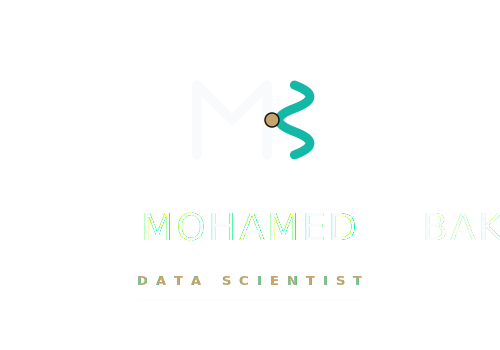

::: {.author-section}

{.author-logo .light-content}
{.author-logo .dark-content}

CIA · CFE · UC Berkeley MIDS

:::

Strategic data scientist with 20+ years of cross-functional experience in internal audit, FP&A, and risk management. Certified Internal Auditor (CIA) and Certified Fraud Examiner (CFE), with a Master of Information and Data Science from UC Berkeley. Specializes in translating business questions into data-driven solutions using Python, SQL, ML, and cloud platforms.

---

## Why This Series

Business professionals in audit, finance, and fraud already reason probabilistically — they update beliefs from evidence, detect anomalies against baselines, and estimate risk under uncertainty. The gap isn't intuition; it's formalism.

Most resources start from abstract theory and never connect it to the decisions practitioners already make. This series starts from the problem. Every topic opens with a scenario you've encountered — then shows the formula that formalizes what you already do.

---

## Experience

### Nisum Technologies Inc. · Brea, CA

**Data Scientist** · Mar 2025 – Present

- Build data science solutions for clients using LLMs, RAG, NLP, and GenAI, deployed in cloud-native environments
- Apply statistical modeling and machine learning to extract actionable insights, improving strategic outcomes
- Collaborate across engineering and product teams to implement scalable analytics pipelines

**FP&A Manager** · Nov 2018 – Feb 2025

- Automated budget variance analysis and forecasting models using Python and advanced analytics, cutting reporting time by 25%
- Conducted root-cause analyses on revenue and utilization trends using statistical methods, enabling more accurate planning
- Built executive dashboards using Power BI and advanced data visualization techniques
- Played a crucial role in strategic planning by quantifying company goals through data-driven analysis

**Sr. Financial Analyst** · Nov 2018 – Apr 2021

- Conducted comprehensive financial forecasts using predictive modeling techniques, improving budget accuracy
- Optimized management reporting through data pipeline automation, leading to 25% reduction in closing time
- Built executive dashboards using Power BI and Excel with advanced analytics to track performance by business unit

---

### Magnell Associate, Inc. (dba Newegg.com) · City of Industry, CA

**Internal Auditor** · Sep 2016 – Nov 2018

- Designed a Python-based system for continuous monitoring of the procurement-to-payment cycle
- Used ML clustering algorithms to detect anomalies and potential fraud, reducing false positives in investigations
- Performed extensive data analysis using VBA, ACL Script, and Python for audit procedures
- Conducted internal fraud investigations using advanced data mining techniques

---

### Foulath Holding B.S.C — Steel Manufacturing · Bahrain

**Senior Audit Officer** · Jan 2015 – Jun 2016

- Planned and executed audits using data analytics and statistical sampling methods
- Developed automated audit working paper systems and cross-referencing filing systems
- Developed and monitored control deficiencies using data-driven risk assessment models

---

### Al Osais Holding — Real Estate & Construction · Dammam, SA

**Internal Auditor** · Dec 2012 – Dec 2014

- Applied data analysis techniques for financial, operational, and compliance audits
- Utilized statistical methods for risk assessment and fraud detection

---

## Education & Credentials

**Master of Information and Data Science (MIDS)** · UC Berkeley School of Information · 2025

**Certified Internal Auditor (CIA)** · The Institute of Internal Auditors

**Certified Fraud Examiner (CFE)** · Association of Certified Fraud Examiners

---

::: {.author-links}
[<i class="bi bi-linkedin"></i>](https://www.linkedin.com/in/mohdbakr/){.author-link title="LinkedIn"}
[<i class="bi bi-github"></i>](https://github.com/Mohdbakr){.author-link title="GitHub"}
[<i class="bi bi-globe2"></i>](https://www.mohdbakr.com){.author-link title="Website"}
:::
