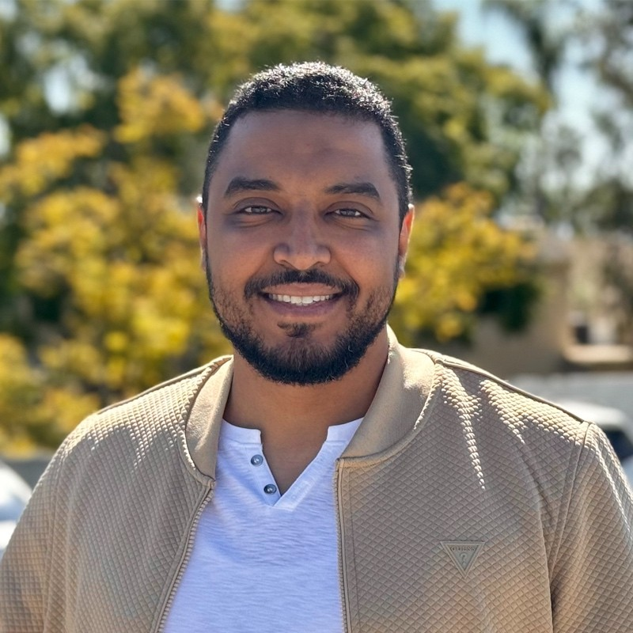

::: {.author-hero}

::: {.author-hero-photo}
{.author-photo}
:::

::: {.author-hero-text}

{.author-logo .light-content}
{.author-logo .dark-content}

::: {.author-bio}
Twenty years across internal audit, FP&A, and risk management — then a pivot into data science. I write about the math that connects those worlds: probability, statistics, and ML grounded in real business problems.

UC Berkeley MIDS · [mohdbakr.com](https://www.mohdbakr.com)
:::

::: {.author-links}
[<i class="bi bi-globe2"></i>](https://www.mohdbakr.com){.author-link title="Website"}
[<i class="bi bi-linkedin"></i>](https://www.linkedin.com/in/mohdbakr/){.author-link title="LinkedIn"}
[<i class="bi bi-github"></i>](https://github.com/Mohdbakr){.author-link title="GitHub"}
:::

:::

:::

---

::: {.experience-section}

::: {.experience-label}
Experience
:::

::: {.timeline}

::: {.timeline-item}
::: {.timeline-dates}
Mar 2025 – Present
:::
::: {.timeline-body}
#### Data Scientist
Nisum Technologies Inc. · Brea, CA
:::
:::

::: {.timeline-item}
::: {.timeline-dates}
Nov 2018 – Feb 2025
:::
::: {.timeline-body}
#### FP&A Manager
Nisum Technologies Inc. · Brea, CA
:::
:::

::: {.timeline-item}
::: {.timeline-dates}
Sep 2016 – Nov 2018
:::
::: {.timeline-body}
#### Internal Auditor
Magnell Associate, Inc. (dba Newegg.com) · City of Industry, CA
:::
:::

::: {.timeline-item}
::: {.timeline-dates}
Jan 2015 – Jun 2016
:::
::: {.timeline-body}
#### Senior Audit Officer
Foulath Holding B.S.C · Bahrain
:::
:::

::: {.timeline-item}
::: {.timeline-dates}
Dec 2012 – Dec 2014
:::
::: {.timeline-body}
#### Internal Auditor
Al Osais Holding · Dammam, SA
:::
:::

:::

[Full experience & education →](about.qmd)

:::
