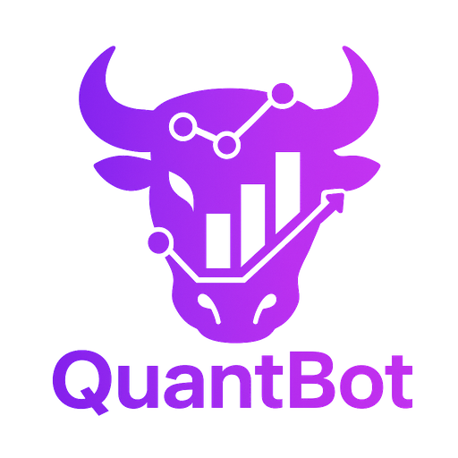
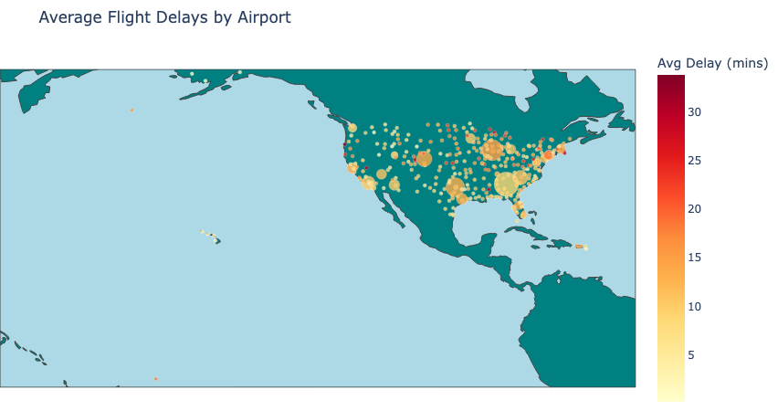
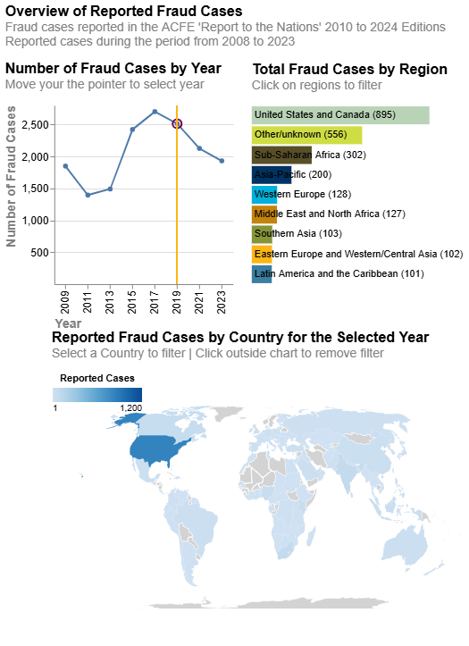

::: {.section-label}
PROJECTS
:::

---

::: {.project-row}
::: {.project-row-img}

:::
::: {.project-row-body}
::: {.project-card-tag}
GENAI · UC BERKELEY · JUL 2025
:::
### Quantbot

A cloud-based chat agent for retail investors — build personalized portfolios based on risk tolerance, budget, and preferences. Multi-agent architecture using Google's ADK, Neo4j for memory and knowledge graphs, Python backend, React frontend. Deployed on AWS with PostgreSQL and Route 53.

[Website](https://thequantbot.com){.project-link} · [Documentation](https://docs.thequantbot.com){.project-link}
:::
:::

---

::: {.project-row}
::: {.project-row-img}

:::
::: {.project-row-body}
::: {.project-card-tag}
ML · UC BERKELEY · APR 2025
:::
### Flight Delay Predictions

Predicting U.S. domestic flight delays from millions of records using Databricks, PySpark, and MLlib. Distributed feature engineering and classification at scale — weather, airline, and airport congestion factors modelled via MapReduce-style pipelines.

[Website](https://bakr-ucb.github.io/261-Final-Project/){.project-link} · [Final Presentation](https://github.com/bakr-UCB/261-Final-Project/blob/main/reports/figures/Phase_III_Final_Presentation.pdf){.project-link}
:::
:::

---

::: {.project-row}
::: {.project-row-img}

:::
::: {.project-row-body}
::: {.project-card-tag}
DATAVIZ · UC BERKELEY · DEC 2024
:::
### Fraud Visualization

Exploring alternative representations of reported fraud cases using Altair. Correlates fraud reporting against corruption perception scores, GDP per capita, and average years of education — providing a richer view of what drives detection.

[Website](https://apps.ischool.berkeley.edu/~subhasis.das/w209/fraud){.project-link}
:::
:::

---

::: {.project-row}
::: {.project-row-img .project-row-img-text}
::: {.project-placeholder}
P&ML
:::
:::
::: {.project-row-body}
::: {.project-card-tag}
SERIES · ACTIVE · APR 2026
:::
### [Probability & ML Foundations](index.qmd)

A 12-week open curriculum on probability and statistics for business practitioners — internal auditors, financial analysts, and fraud examiners. Each lesson opens with a real business problem. English and Arabic.

[Week 1 →](content/en/week-01-conditioning.qmd){.project-link}
:::
:::
